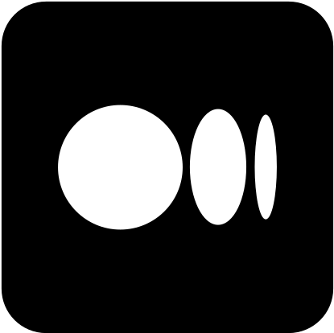
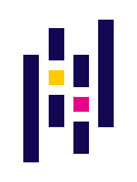
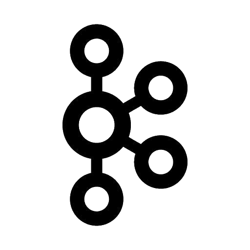

<h1 align="center" id="peterbaccaro-title">Hi :wave:, I'm Peter Baccaro</h1>
<h3 align="center">Tech Lead/Delivery Architect</h3>

  

<h2 align="left">Connect with me on:</h2>

<table>
  <tr>
    <td align="center" width="96">
      
       LinkedIn
    </td>
    <td align="center" width="96">
      
       Medium
    </td>
  </tr>
</table>

<h2 align="left">Blogs Posts</h2
<!-- BLOG-POST-LIST:START -->
<!-- BLOG-POST-LIST:END -->

<h2 align="left">Technologies I Use</h2>

<table>
  <tr>
    <td align="center" width="96">
      
       Python
    </td>
    <td align="center" width="96">
      
       Go
    </td>
    <td align="center" width="96">
      
       C# (Core)
    </td>
    <td align="center" width="96">
      
       PowerShell
    </td>
    <td align="center" width="96">
        
         Jupyter
    </td>
    <td align="center" width="96">
        
         VSCode
    </td>
    <td align="center" width="96">
        
         VStudio
    </td>
    <td align="center" width="96">
        
         Git
    </td>
    <td align="center" width="96">
        
         GitHub
    </td>
  </tr>
  <tr>
    <td align="center" width="96">
      
       Pandas
    </td>
    <td align="center" width="96">
      
       Numpy
    </td>
    <td align="center" width="96">
      
       .NET Core
    </td>
    <td align="center" width="96">
      
       PUML
    </td>
    <td align="center" width="96">
      
       diagrams.net
    </td>
    <td align="center" width="96">
      
       Jira
    </td>
    <td align="center" width="96">
      
       Confluence
    </td>
    <td align="center" width="96">
      
       Slack
    </td>
    <td align="center" width="96">
      
       MS Teams
    </td>
  </tr>
  <tr>
    <td align="center" width="96">
      
       Dagster
    </td>
    <td align="center" width="96">
        
         ADF
    </td>
    <td align="center" width="96">
      
       Azure Funcs
    </td>
    <td align="center"  width="96">
      
       Kafka
    </td>
    <td align="center" width="96">
        
         RedPanda
    </td>
    <td align="center" width="96">
      
       NATS
    </td>
    <td align="center" width="96">
        
         Azure SQL
    </td>
    <td align="center" width="96">
      
       MongoDB
    </td>
    <td align="center" width="96">
      
       MS SQL
    </td>
  </tr>
  <tr>
    <td align="center" width="96">
      
       Azure
    </td>
    <td align="center" width="96">
        
         AWS
    </td>
    <td align="center" width="96"> 
      
       Docker
    </td>
    <td align="center" width="96">
      
       Kubernetes
    </td>
    <td align="center" width="96">
      
       Flux
    </td>
    <td align="center" width="96">
      
       Linux
    </td>
    <td align="center" width="96">
      
       Windows
    </td>
    <td align="center" width="96">
      
       Grafana
    </td>
    <td align="center" width="96">
      
       Prometheus
    </td>
  </tr>
</table>
